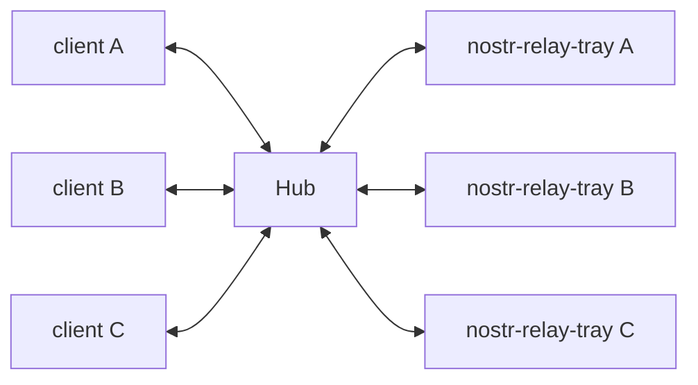

# Tray Hub

## Usage

```bash
# Install dependencies
npm install

# Build
npm run build

# Run
npm start
```

## Environment Variables

- `PORT`: (Optional) Port to run the server on. Default: `3000`
- `PASSWORD`: (Optional) Password for the relay to authenticate with the hub. If set, the relay should add the password to the url like `wss://<password>@<domain>/join`
- `MAX_CONNECTIONS`: (Optional) Maximum number of connections to the relay. Default: `20`
- `DOMAIN`: (Optional) Domain of the server, used for NIP-42. If not set, NIP-42 is disabled
- `LOG_DIR`: (Optional) Directory to store logs. If not set, log to stdout
- `TRUST_RELAY`: (Optional) If set to true, the performance will be better as it does not validate the events returned by the relay. Default: `false`
- `PUBKEY`: (Optional) Public key of the relay
- `CONTACT`: (Optional) Contact information for the relay

## How it works



## Donate

If you like this project, you can buy me a coffee :) ⚡️ codytseng@getalby.com ⚡️

## License

MIT
